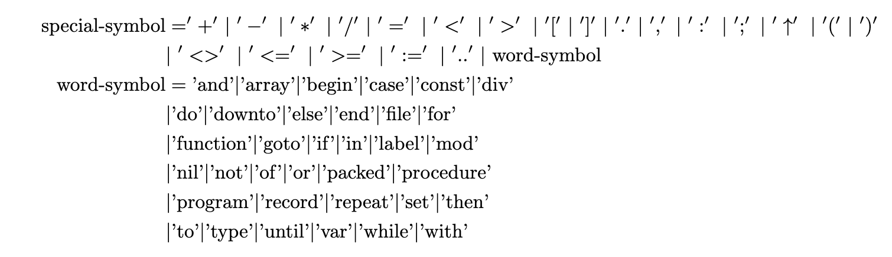
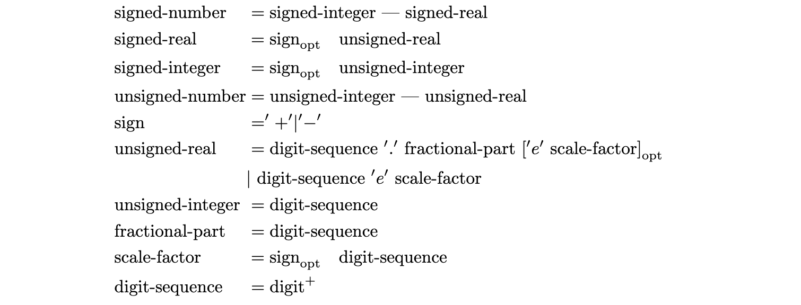
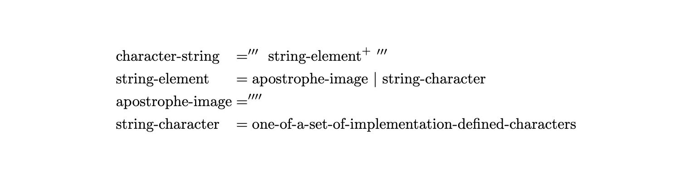
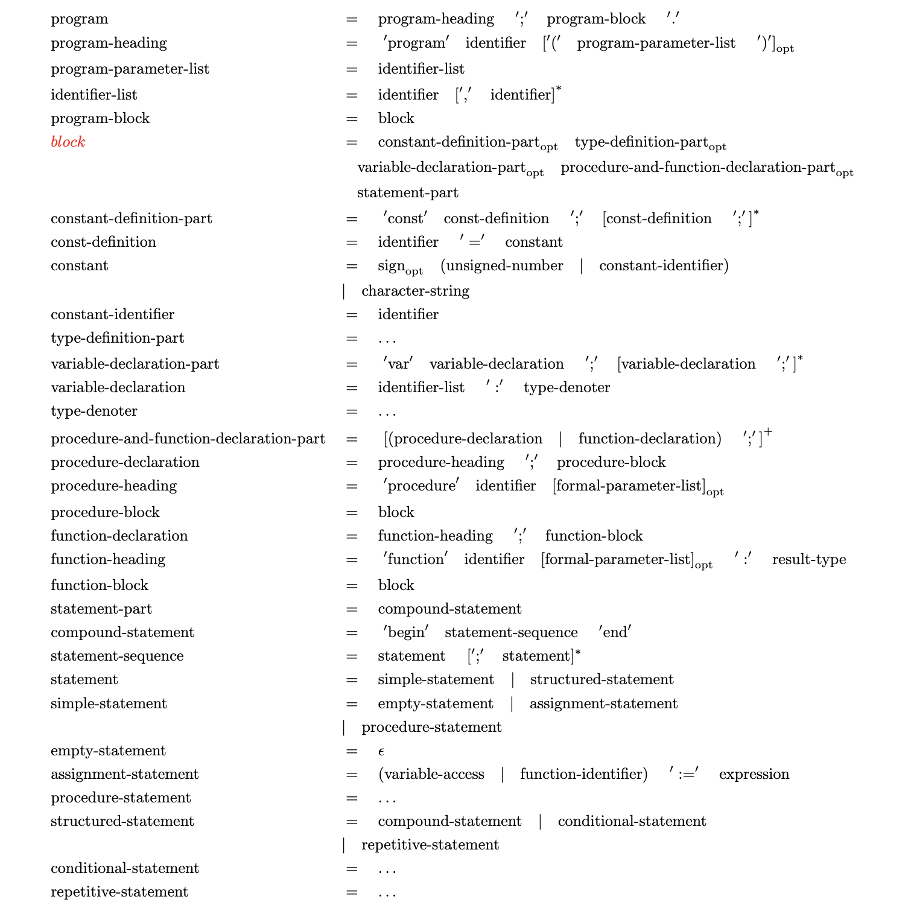

# About pascal

- [wiki](https://en.wikipedia.org/wiki/Pascal_(programming_language))
- [standard](https://web.archive.org/web/20160127044422/http://pascal-central.com/docs/iso7185.pdf)
- [compiler explore](https://godbolt.org/)

## Lexical tokens

### General


### Special symbols



### Identifiers

> <font color=red>不区分大小写</font>


### Numbers



Examples:

- 1e10
- 1
- +100
- -0.1
- 5e-3
- 87.35E+8

### Character-strings



Examples:

- 'A'
- ';'
- ''''
- 'Pascal'
- 'THIS IS A STRING'

### Token separators

> Comments, spaces (except in character-strings), and the separations of consecutive lines shall be
considered to be token separators.

#### Comments

``` pascal
{ commentary }
(* commentary *)
// commentary
```

## Grammar



与ISO标准的区别:

- Record
- Label
- With-statement