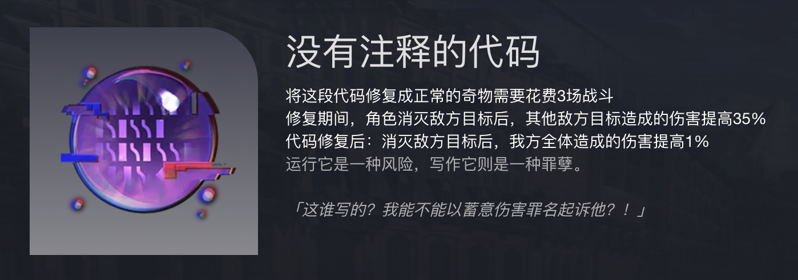

# 团队分工

总监: 朱宏明

词法语法: 马方舟，曾辉

语义分析: 夏博焕，张新博

代码生成: 伏培燚，窦力扬

|          | 是否按时完成培训任务 | 是否按时完成编程任务 | 是否按时完成测试任务 | 自我评价 |
| -------- | ---------------- | ---------------- | ----------------- | ------ |
| 朱宏明    |                  |                  |                   |        |
| 马方舟    |                  |                  |                   |        |
| 曾辉      |                  |                  |                   |        |
| 夏博焕    |                  |                  |                   |        |
| 张新博    |                  |                  |                   |        |
| 伏培燚    |                  |                  |                   |        |      
| 窦力扬    |                  |                  |                   |        |      

## 团队成员基本素质

1. 具有基本的编程能力，包含但不限于算法与数据结构，C++面向对象编程与Vistor设计模式
2. 能够清楚地认识自己被分配的任务，并主动进行相关的培训，包含但不限于flex，bison工具的学习
3. 熟悉git版本管理工具，能够高效地进行多人合作编程

## 基本要求

1. 以测试为导向，永远不提交没有测试过的代码
2. 要求对每一个类与方法提供注释
3. 自觉完成每周的学习与编程任务
4. 诚信，如果借鉴了开源代码，则必须在代码和文档中提供链接

